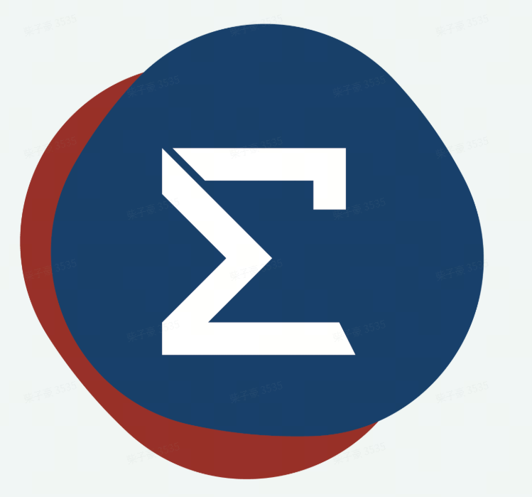

<div align="center">



# smrcore_sdk

**Build, integrate, and deploy robot applications on the Smartmore Robot SDK.**

[](LICENSE)
[](https://smore-robotics.github.io/smrcore_sdk/)
[](https://github.com/smore-robotics/smrcore_sdk/actions/workflows/ci.yml)
[](https://github.com/smore-robotics/smrcore_sdk/releases)

**English** · [简体中文](README.zh.md)

</div>

---

The public integration repository for the **Smartmore Robot SDK**. It ships
build scripts, runnable C++ and Python examples, and release download helpers
for the prebuilt C++ SDK and Python wheel. It does **not** contain SDK source
code.

## Documentation

Installation, usage, the full example walkthrough, and the C++ API reference all
live on the documentation site.

- **[Documentation site](https://smore-robotics.github.io/smrcore_sdk/)**
- **[中文文档](https://smore-robotics.github.io/smrcore_sdk/zh/)**
- **[Python SDK](https://smore-robotics.github.io/smrcore_sdk/python/)**
- **[C++ API reference](https://smore-robotics.github.io/smrcore_sdk/api/cpp/)**

## Quick Start

### C++

```bash
git clone https://github.com/smore-robotics/smrcore_sdk.git
cd smrcore_sdk

./scripts/download.sh            # fetch the latest prebuilt C++ SDK
./scripts/build.sh               # build the C++ examples

./build/basics_connect [robot_ip] # omit robot_ip for local simulation
```

### Python

```bash
VERSION=0.0.1  # replace with the release version you want
PY_TAG=cp310-cp310-linux_x86_64   # Windows: cp310-cp310-win_amd64
curl -L -O "https://github.com/smore-robotics/smrcore_sdk/releases/download/v${VERSION}/rcore_sdk_py-${VERSION}-${PY_TAG}.whl"
python3 -m pip install "./rcore_sdk_py-${VERSION}-${PY_TAG}.whl"

python3 examples_py/basics/connect.py [robot_ip] # omit robot_ip for local simulation
```

More setup and examples are on the
[documentation site](https://smore-robotics.github.io/smrcore_sdk/).

## Release Assets

Release assets are published on the
**[Releases page](https://github.com/smore-robotics/smrcore_sdk/releases)**:

| Asset | Description |
|---|---|
| `smrcore_sdk-cpp-linux-x86_64-v<version>.tar.gz` | C++ SDK for Linux x86_64 |
| `smrcore_sdk-cpp-windows-x86_64-v<version>.tar.gz` | C++ SDK for Windows x86_64 |
| `rcore_sdk_py-<version>-<python-tags>.whl` | Python wheel (per Python ABI / platform) |
| `smrcore-simulator-linux-x86_64-v<version>.tar.gz` | Local simulator — run examples without hardware |
| `smrcore_sdk-docs-zh-v<version>.pdf` | Chinese documentation PDF |

## Safety

> Robots are hazardous machines. Before running any motion example, verify the
> target in the example source is safe for your robot, tool, payload, and
> workspace. Confirm the emergency stop is reachable and the workspace is clear.

## License

This repository (examples, scripts, and docs) is released under the
[Apache License 2.0](LICENSE). Prebuilt SDK release artifacts bundle third-party
components whose license and attribution notices ship inside each release
archive.

<div align="center">

Copyright © Smartmore Corporation

</div>
